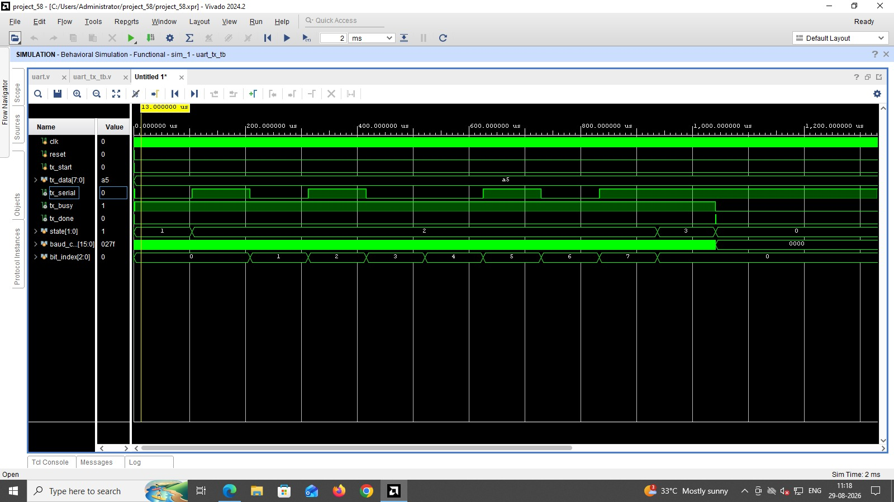
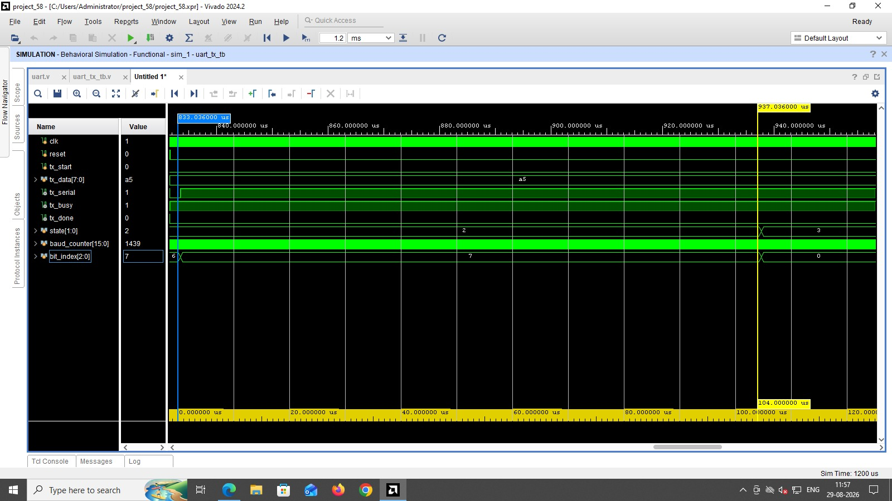
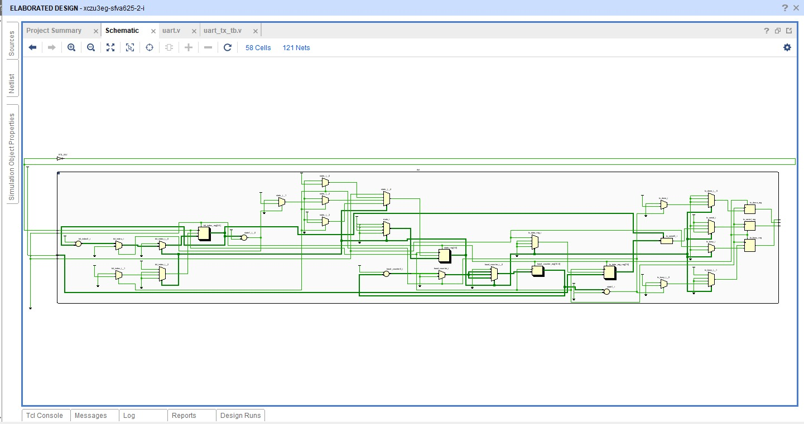
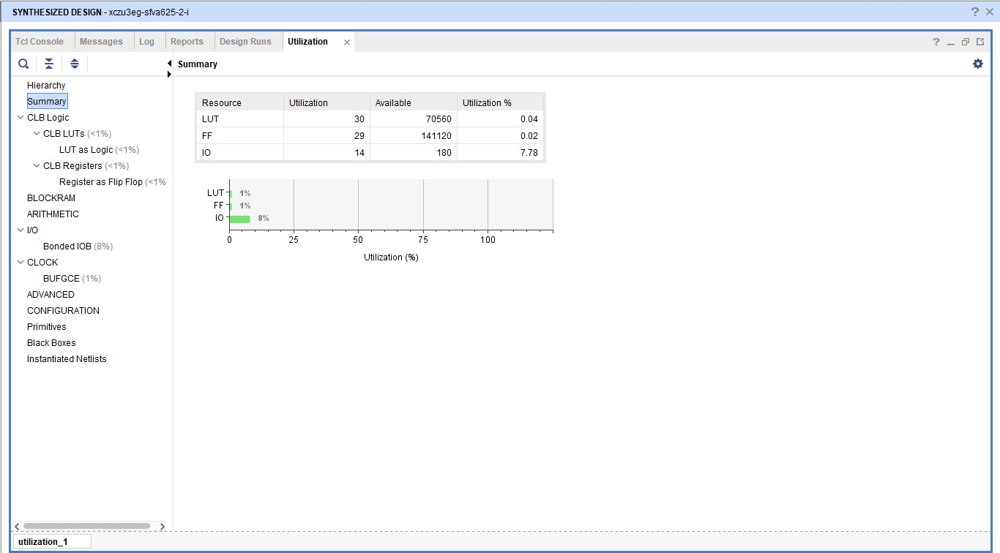

# UART TX/RX using Verilog

This project focuses on the design and verification of a UART communication system using Verilog HDL.

## Current Progress

The UART Transmitter has been implemented and verified.

### Completed

* UART Transmitter RTL design
* FSM-based transmission control
* Start bit, 8-bit data, and stop bit generation
* Baud-rate timing using a clock counter
* `tx_busy` and `tx_done` status signals
* Behavioral simulation
* Bit timing verification
* Synthesis and resource utilization analysis

### In Progress

* UART Receiver design
* TX-RX integration
* Complete communication verification

## Tools Used

* Verilog HDL
* Xilinx Vivado

## Project Structure

```text
UART-TX-RX-Verilog/
├── rtl/
│   └── uart_tx.v
├── tb/
│   └── uart_tx_tb.v
├── docs/
│   ├── uart_tx_waveform.png
│   ├── uart_tx_bit_timing.png
│   ├── uart_tx_schematic.png
│   └── uart_tx_utilization.png
└── README.md
```

## UART Transmitter

The transmitter sends data in a standard UART frame consisting of:

```text
Idle → Start Bit → D0 → D1 → D2 → D3 → D4 → D5 → D6 → D7 → Stop Bit
```

The data bits are transmitted LSB first.

## Simulation Result

The transmitter operation was verified using Vivado behavioral simulation.



The waveform verifies the transmission sequence, bit index progression, FSM operation, `tx_busy`, and `tx_done` signals.

## Baud Rate Verification

For a baud rate of 9600:

$$
T_{bit} = \frac{1}{9600} \approx 104.17 \mu s
$$

The measured simulation bit duration is approximately 104 µs.



## Synthesized Schematic



## FPGA Resource Utilization

The synthesized UART transmitter uses approximately:

* 30 LUTs
* 29 Flip-Flops
* 14 I/O resources



## Status

**Ongoing Project**

UART Transmitter completed and verified. UART Receiver implementation is the next stage.
